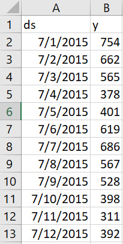

# Forecasting with Facebook Prophet in Python Notebook in Google Colab
## What is forecasting?
Forecasting is the process of using mathematical models to make an educated guess of what will happen in the future. While intuitively simple, the underlying math can (and does) vary greatly across methodologies. This post seeks to cover one tool, Facebook Prophet, and walk the reader through how to create a forecast in Google Colab.  

## What is Facebook Prophet?
<a href="https://facebook.github.io/prophet/">Facebook Prophet</a> is a forecasting library for R and Python. It takes trended data as input and outputs a forecast. Facebook Prophet uses an additive model.

## What is Google Colab?
<a href="https://colab.research.google.com/">Google Colab</a> allows users to run Python Notebooks in a browser.
         
## Why should you learn?
Learning how to forecast, can help you:
* Make more informed, proactive decisions 
* Assess impact of an event (using a forecast to determine *what **should have** happened* vs. *what **actually** happened*)
* Set realistic and stretch goals
* Be prepared for when someone (maybe a boss or client) asks you to predict the future

## What is the expected reading level?
* Limited coding experience required
* Familiar with fundamental coding concepts (e.g., commenting, printing)

## Recipe for creating a forecast with trended data
### 1. First, we need to start with trended data. For learning, we can use INSERT PAGE
* Must be in a `.csv` file format
* Must only have two columns 
* Column A must be labelled with header "ds" 
* Column B must be labelled with header "y"
* All dates in Column A must be formatted as "YYYY-MM-DD" (e.g., 2007-12-10)



### 2.  Open the following URLs
* <a href="https://facebook.github.io/prophet/docs/quick_start.html#python-api">Facebook Prophet - Getting Started Guide</a>
* <a href="https://colab.research.google.com/">Google Colab</a> 

### 3. In Google Colabs click [NEW NOTEBOOK] to create a new notebook


### 4.  Upload the data into Google Colabs
* On the lefthand rail, click on the file icon
* Find the folder called [content]
         * [content] is our root directory in our Colab notebook. By adding content directly into the [content] folder, we avoid complex filepaths later on.
* Upload the `.csv` file we prepared in step one


### 5. In the first cell add the following code, update the file name, and run this cell

```
# imports pandas library, which allows you to manipulate data within Python Notebooks
import pandas as pd 

# imports the Facebook Prophet library
from fbprophet import Prophet

# creates a dataframe called "df", which reads in the csv
# update **your-file-name**
df = pd.read_csv('your-file-name.csv')

# if you would like to test, comment out the line above and uncomment the line below to use the test data source
# the dataset below covers Wikipedia's technical writing page's pageviews data
# df = pd.read_csv('https://raw.githubusercontent.com/als429/600/main/assignments/3/technical-writing-pageviews.csv')

# prints the first five lines of the dataframe table as output
df.head()
```
<a href="https://pageviews.toolforge.org/?project=en.wikipedia.org&platform=all-access&agent=user&redirects=0&range=all-time&pages=Technical_writing">Data available here</a>

If all goes well, you should see a print out of your data, similar to the example below:


### 6. 
```
# instantiates a Prophet object
m = Prophet()

# fits the Prophet object to the data we added
m.fit(df)

# makes a dataframe with future dates for forecasting
future = m.make_future_dataframe(periods=365)

# prints the last five rows of the prediction
future.tail()
```


### 7. 

```
# gets the yhat value
forecast = m.predict(future)

# prints the last five rows of the forecast ds, yhat, yhat_lower, and yhat_upper 
forecast[['ds', 'yhat', 'yhat_lower', 'yhat_upper']].tail()
```

### 8. 

```
# plot the data on a scatter plot
fig1 = m.plot(forecast)
```

### 9. 

```
# plot the data components 
fig2 = m.plot_components(forecast)
```
